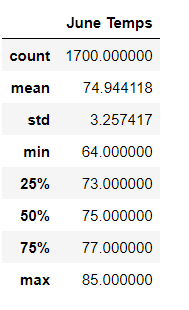
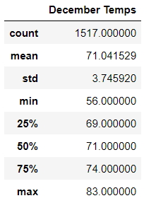

# Surfs up

## Overview of the Surf n' Shake Shop Analysis

### Purpose

I plan to start my own business in Oahu, Hawaii. The business will consist of a Surf n' Shake shop, where surfboards and ice cream will be sold to the locals.

W.Avy has expressed interest in investing in this venture but is concerned about the weather patterns of the area.

The purpose of this project is to analyze the previous weather patterns of Oahu by gathering data on year-round temperatures, especially comparing the summer temperatures with the winter temperatures, where there exists an increased probability of weather fluctuations. The temperatures for the months of June and December were sampled and analyzed.

## Results 

### Results of Surf n' Shake  

Three key differences were discovered during these two months and are listed below:

- The minimum temps between June and December differ significantly compared to their maximum temps. In June, they differ by 12 degrees: 64° F in June (Figure 1) and 56° F in December (Figure 2).  

- The standard deviation for the June temperatures is approximately 3.26° F whereas in the December temperatures it is 3.75° F.  

- The mean temperature for the month of June is 74.94° F, and in December it is 71.04° F.

#### Figure 1
  

#### Figure 2
  

## Summary

### Summary and Recomendations

 Although there have been lower temperatures recorded for the month of December, according to the summary statistics, there is minimal amount of difference in recorded high temps between June and December, as well as a minimal difference between the average temperatures. This indicates that temperatures in Oahu tend to remain relatively warm year-round, which results in favorable surfing conditions. 

 It is recommended to continue forward with the plan to open a Surf n' Shake shop in the island of Oahu.

 

